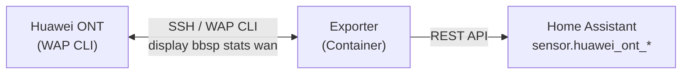

# Huawei ONT Bandwidth Exporter for Home Assistant

A lightweight containerized service that reads the byte counters (BytesSent / BytesReceived) from a Huawei ONT/GPON router over SSH and pushes them to [Home Assistant](https://www.home-assistant.io) as sensors.

Most ISPs disable SNMP on their CPEs, so you can't query traffic counters that way. Huawei ONTs still expose them through the management CLI, which this tool automates over SSH with Dropbear's `dbclient`.

## Pre-built image (GHCR)

Ready-made multi-arch images (amd64 + arm64) are published to GitHub Container Registry when a version is tagged. Each `vX.Y.Z` tag publishes that version, updates `latest`, and creates a GitHub Release with auto-generated notes.

```sh
podman pull ghcr.io/yasogan/ha-huawei-ont-exporter:latest
# or pin a version
podman pull ghcr.io/yasogan/ha-huawei-ont-exporter:1.0.0
```

Then run it as in [Quick start](#quick-start), using the pulled image name instead of building locally. To publish a new release, tag and push:

```sh
git tag v1.0.0 && git push origin v1.0.0
```

## How it works



1. `get_stats.sh` logs into the ONT over SSH with Dropbear's `dbclient` (password supplied via `DROPBEAR_PASSWORD`, so no `sshpass` needed) and runs `display bbsp stats wan`. The ONT's WAP shell does not accept remote commands, so the command is typed into the session — the script waits for the `WAP>` prompt before typing and for the ONT's `success!` before logging out, so it is immune to connection timing.
2. `main.sh` parses the output with `awk`, extracting the byte and frame counters for a configurable WAN interface (default `wan1`).
3. The per-frame wire overhead (framing, VLAN, PPPoE) is deducted to get the real usable bytes — see [Overhead deduction](#overhead-deduction).
4. The corrected counters are posted to the Home Assistant REST API as `total_increasing` sensors.

The container loops forever, re-reading the counters every `INTERVAL` seconds.

## What's inside

| File                            | Purpose                                                    |
| ------------------------------- | ---------------------------------------------------------- |
| `Dockerfile`                    | Alpine-based image (~9 MB) with dropbear dbclient and wget |
| `docker-compose.yml`            | Compose deployment (env file, restart, healthcheck)        |
| `huawei-ont-exporter.container` | Podman Quadlet unit (systemd-managed container)            |
| `Makefile`                      | `make build/run/logs/status/stop/once/shell/test`          |
| `scripts/entrypoint.sh`         | Polling loop with failure backoff, or a one-shot command   |
| `scripts/main.sh`               | dbclient + parse + deduct overhead + push to HA            |
| `scripts/config.sh`             | Central env handling: defaults, validation, normalization |
| `scripts/parse_stats.sh`        | Pure parse/deduct/payload logic (shared with the tests)    |
| `scripts/get_stats.sh`          | dbclient SSH session against the ONT CLI                   |
| `scripts/healthcheck.sh`        | Container healthcheck (last successful run freshness)      |
| `scripts/test.sh`               | Unit tests: parser, overhead math, golden payload (`make test` and CI) |
| `.env.example`                  | Template for the required environment variables            |

## Prerequisites

- [Podman](https://podman.io) or [Docker](https://docker.com)
- A Huawei ONT reachable over SSH with the default `adminHW` login (or your own credentials)
- A Home Assistant [long-lived access token](https://www.home-assistant.io/docs/authentication/#your-account-profile) with access to the REST API

## Quick start

### 1. Prepare configuration

```sh
cp .env.example .env
# then edit .env and set at least HA_IP, HA_TOKEN, and ONT_* values
```

### 2. Build

```sh
podman build -t huawei-ont-exporter .
```

### 3. Run

```sh
podman run -d --name huawei-ont-exporter \
  --restart unless-stopped \
  --env-file .env \
  -v /etc/localtime:/etc/localtime:ro \
  huawei-ont-exporter
```

With Docker:

```sh
docker run -d --name huawei-ont-exporter \
  --restart unless-stopped \
  --env-file .env \
  -v /etc/localtime:/etc/localtime:ro \
  huawei-ont-exporter
```

The `-v /etc/localtime:/etc/localtime:ro` mount makes log timestamps local; without it, logs are in UTC. The compose, Quadlet and Makefile examples below already include it.

Or with Docker/Podman Compose:

```sh
docker compose up -d     # or: podman-compose up -d
```

Or with the Makefile (build/run/logs/status/stop/once/shell):

```sh
make build && make run && make status
```

### Run as a systemd service (Podman Quadlet)

For a native systemd setup, use the provided `huawei-ont-exporter.container` Quadlet unit:

```sh
sudo mkdir -p /etc/huawei-ont-exporter
sudo cp .env /etc/huawei-ont-exporter/.env            # after editing it
sudo cp huawei-ont-exporter.container /etc/containers/systemd/
sudo systemctl daemon-reload
sudo systemctl enable --now huawei-ont-exporter.service
```

Logs: `journalctl -u huawei-ont-exporter.service -f` · Status/health: `systemctl status huawei-ont-exporter.service`

The container runs as a non-root user and never needs to expose or publish any ports — it only makes outbound SSH and HTTP connections.

The image has a built-in `HEALTHCHECK` that reports healthy while the last successful poll is recent (see `STATUS_FILE` / `HEALTHCHECK_MAX_AGE`), so `podman ps` shows real health:

```
NAMES                      STATUS                     HEALTH
huawei-ont-exporter        Up 2 hours (healthy)       healthy
```

### Check it's working

```sh
podman logs -f huawei-ont-exporter
```

You should see a line like:

```
[2026-08-09 15:00:00] [INFO] Read stats for wan1 (overhead 42 B/frame):
[2026-08-09 15:00:00] [INFO]   sent:     raw=152042884343 B / 152757900 frames -> 145627052543 B
[2026-08-09 15:00:00] [INFO]   received: raw=162439892682 B / 182636346 frames -> 154769166150 B
[2026-08-09 15:00:01] [INFO] Successfully pushed Huawei ONT stats to Home Assistant.
```

## Configuration

All settings are environment variables, provided via `--env-file .env` (see `.env.example`). The connection settings (`HA_*` and `ONT_*`) are **required** — the exporter refuses to start without them. The rest have sane defaults.

| Variable              | Default                           | Description                                                                      |
| --------------------- | --------------------------------- | -------------------------------------------------------------------------------- |
| `HA_IP`               | _(required)_                      | Home Assistant host IP                                                           |
| `HA_PORT`             | `8123`                            | Home Assistant REST API port                                                     |
| `HA_SCHEME`           | `http`                            | `http` or `https` (https needs a trusted cert; busybox wget skips no validation) |
| `HA_TOKEN`            | _(required)_                      | Home Assistant long-lived access token                                           |
| `ONT_HOST`            | _(required)_                      | ONT management IP                                                                |
| `ONT_USER`            | _(required)_                      | SSH user for the ONT                                                             |
| `ONT_PASS`            | _(required)_                      | SSH password for the ONT                                                         |
| `WAN_INTERFACE`       | `wan1`                            | WAN interface to read counters from (`wan1`/`wan2`/...)                          |
| `INTERVAL`            | `60`                              | Seconds between polling cycles (loop mode only; **min 60**)                      |
| `VLAN_ENABLED`        | `true`                            | Deduct the 4 B 802.1Q VLAN tag per frame (see below)                             |
| `PPPOE_ENABLED`       | `false`                           | Deduct the 8 B PPPoE encapsulation per frame (see below)                         |
| `DRY_RUN`             | `false`                           | Read + log stats but do not push anything to Home Assistant                      |
| `MAX_BACKOFF`         | `3600`                            | Cap (seconds) on the exponential backoff after failures                          |
| `PROMPT_TIMEOUT`      | `15`                              | Max seconds to wait for the `WAP>` prompt before giving up                       |
| `OUTPUT_TIMEOUT`      | `20`                              | Max seconds to wait for the command output before quitting                       |
| `COMMAND_ATTEMPTS`    | `3`                               | Re-send the command until stats come back (drops happen)                         |
| `AUTO_KILL_SESSIONS`  | `true`                            | Auto-remove a stale SSH session when the ONT's one-session limit is hit          |
| `CLOSE_GRACE`         | `3`                               | Seconds to wait after `quit` for the ONT to close before the session is force-killed |
| `STATUS_FILE`         | `/tmp/huawei_ont_exporter_status` | File stamped with the last successful run (healthcheck)                          |
| `HEALTHCHECK_MAX_AGE` | `300`                             | Max age (seconds) of the status file for a healthy check                         |

## Running it once / testing

Read the stats from your ONT **without touching Home Assistant** (useful to validate your `ONT_*` settings, VLAN/PPPoE flags, and WAN interface):

```sh
DRY_RUN=true podman run --rm --env-file .env huawei-ont-exporter /app/main.sh
```

You'll see the config summary, the parsed stats, and what would have been pushed. Every run logs a startup config summary with the effective settings (secrets only shown by length, never their values).

Prefer not to keep the container running? Run a one-shot and let your own cron or systemd timer handle the schedule:

```sh
podman run --rm --env-file .env huawei-ont-exporter /app/main.sh
```

The entrypoint runs any command passed to it; with no command it enters the polling loop. `INTERVAL` is ignored in one-shot mode.

### Unit tests

The risky pure logic (the `awk` parser and the overhead-deduction math) has unit tests that run from a sample `display bbsp stats wan` capture — including a golden-file check on the total sensor's payload shape. They run locally via `make test` and in CI on every push/PR:

```sh
make test
```

## Overhead deduction

The ONT's `BytesSent` / `BytesReceived` counters include every byte that went onto the wire, but ISPs don't bill for all of it. BNG and RADIUS accounting counts **IP-layer octets** — the IP datagrams passed over the session, including the IP header but excluding everything below it (L1 physical framing and L2 Ethernet/PPP encapsulation). That lower-layer overhead is the ISP's job to carry, not something you pay for, so it shouldn't count against your usage either. The frame counters tell you how many frames those bytes were split across, so the per-frame overhead can be deducted:

| Component                            | Bytes/frame | Applied              |
| ------------------------------------ | ----------- | -------------------- |
| Preamble + SFD                       | 8           | always               |
| Inter-Frame Gap (IFG)                | 12          | always               |
| Ethernet MAC header (6+6+2)          | 14          | always               |
| FCS / CRC32                          | 4           | always               |
| 802.1Q VLAN tag                      | 4           | `VLAN_ENABLED=true`  |
| PPPoE header + PPP protocol ID (6+2) | 8           | `PPPOE_ENABLED=true` |

```
net_bytes = raw_bytes - frames * (38 + (VLAN_ENABLED ? 4 : 0) + (PPPOE_ENABLED ? 8 : 0))
```

Because billing happens at the IP layer, the **IP header itself is not deducted** — only the L1/L2 framing and the PPPoE wrapper. VLAN tagging on the WAN/Internet service is used by almost all ISPs (e.g. SLT, Dialog, and most GPON deployments), so it defaults to `true`. PPPoE is ISP-specific and disabled by default — enable it only if your connection actually uses PPPoE. The resulting `overhead_per_frame` is shown in the logs and stored on each sensor's attributes.

## Home Assistant sensors

Each run posts three states. The state is the **overhead-corrected** byte count; the raw counters and frame counts are stored as attributes.

| Entity                             | Value                           |
| ---------------------------------- | ------------------------------- |
| `sensor.huawei_ont_bytes_received` | Corrected bytes received (down) |
| `sensor.huawei_ont_bytes_sent`     | Corrected bytes sent (up)       |
| `sensor.huawei_ont_bytes_total`    | Corrected sent + received       |

Attributes: `raw_bytes`, `frames`, `overhead_per_frame`.

All sensors use `unit_of_measurement: B`, `device_class: data_size`, and `state_class: total_increasing`, so Home Assistant will correctly derive down/up rates (e.g. for the energy & data dashboards).

> The values are the router's lifetime counters. Because they are monotonically increasing and may be huge (hundreds of GB), keep `state_class: total_increasing` — Home Assistant computes deltas for you.

## Tested devices

The exporter is developed and verified against the following ONTs:

| Device          | Notes                                                                                                                                                                                     |
| --------------- | ----------------------------------------------------------------------------------------------------------------------------------------------------------------------------------------- |
| Huawei HG8245H5 | GPON ONT. SSH runs Dropbear (legacy `ssh-rsa` host key only), login shell is the `WAP>` CLI, and `display bbsp stats wan` reports the `wan1`/`wan2`/`wan3` counters used by the exporter. |

The behaviors the exporter accounts for were observed on this device: the `WAP>` shell rejects remote-command (`exec`) requests with a connection reset, drops input typed before the prompt is ready, and allows only one concurrent SSH session. If your device behaves differently, `PROMPT_TIMEOUT`, `COMMAND_ATTEMPTS` and `AUTO_KILL_SESSIONS` cover the common variations.

## Troubleshooting

**`Stats script failed with exit code 1`**

Run the SSH script directly to see the raw error:

```sh
podman run --rm --env-file .env huawei-ont-exporter /app/get_stats.sh
```

Common causes:

- Wrong `ONT_HOST` / `ONT_USER` / `ONT_PASS`.
- `Connection reset by peer` immediately after login — this is the ONT's Dropbear resetting on the SSH exec request. This is expected for remote commands; the exporter deliberately drives the WAP shell interactively instead, so ignore it if you see it while testing other tools.
- The ONT's WAN interfaces have different names — run `display bbsp stats wan` manually and check which WAN you want (`wan1`, `wan2`, ...). The sample output at the end of this README shows `wan1` as the WAN with real traffic.
- The ONT uses legacy `ssh-rsa` host keys — Dropbear's `dbclient` supports them out of the box (no extra options needed), so this only matters if you test with a modern OpenSSH client directly.
- The `dbclient` in the image is pinned from the Alpine v3.21 repo: Dropbear ≥2025 dropped the `ssh-rsa` algorithm entirely, which would make the client unable to connect to the ONT's old SSH server at all.
- If the prompt is slow to appear, the exporter gives up after `PROMPT_TIMEOUT` (default 15 s) and after `OUTPUT_TIMEOUT` (default 20 s) waiting for the command output — tune these via the environment if needed.

**`The number of sessions exceeds the specifications`**

The ONT allows only **one** SSH session at a time and holds it briefly after each poll. When a new login hits that limit, the exporter answers the prompt to remove the listed stale session automatically (`AUTO_KILL_SESSIONS=true`, the default). If you'd rather it just fail and retry with backoff instead, set `AUTO_KILL_SESSIONS=false`.

**`Expected stats but got 0`**

Check the `overhead_per_frame` in the log. If you set `VLAN_ENABLED` or `PPPOE_ENABLED` incorrectly (e.g. PPPoE enabled on a DHCP + VLAN connection), the deduction will over-subtract and the corrected values will be wrong or clamped to 0.

**`Could not find WAN interface 'wan1' in ONT output`**

The ONT did not report that interface. Set `WAN_INTERFACE` to an interface that actually exists (check with `display bbsp stats wan`).

**`Home Assistant returned HTTP 401`**

Bad or expired `HA_TOKEN`. The token needs the `read` and `write` scopes.

**`Home Assistant returned HTTP 404`**

Nothing to worry about — the entity does not exist yet and is created on the first successful push.

## Security notes

- `ONT_PASS` is commonly the well-known factory password `adminHW` for Huawei ONTs. It appears in every online tutorial; if your device still uses it, consider restricting SSH access to your LAN only.
- `HA_TOKEN` is a long-lived token — treat it like a password. Keep it in `.env` (already gitignored) and never commit it.
- The container runs as an unprivileged user and needs no published ports.

## Example ONT output

`display bbsp stats wan` returns something like:

```
-----------------------------------------
wan1 packet statistic:
    WAN Status              : Connected
    BytesSent               : 152042884343
    BytesReceived           : 162439892682
    FrameSent               : 152757900
    FrameReceived           : 182636346
    ...
-----------------------------------------
```

The exporter reads `BytesSent`, `BytesReceived`, `FrameSent` and `FrameReceived` from the interface selected by `WAN_INTERFACE`, then applies the [overhead deduction](#overhead-deduction).
