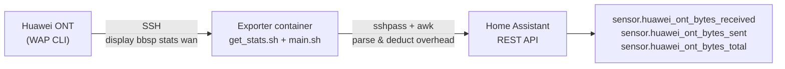

# Huawei ONT Bandwidth Exporter for Home Assistant

A lightweight containerized service that reads the byte counters (BytesSent /
BytesReceived) from a Huawei ONT/GPON router over SSH and pushes them to
[Home Assistant](https://www.home-assistant.io) as sensors.

Most ISPs disable SNMP on their CPEs, so you can't query traffic counters that
way. Huawei ONTs still expose them through the management CLI, which this tool
automates over SSH with `sshpass`.

## How it works



1. `get_stats.sh` logs into the ONT over SSH with `sshpass` (including the
   legacy `ssh-rsa` key support these routers require) and runs
   `display bbsp stats wan`. The ONT's WAP shell does not accept remote
   commands, so the command is typed through an interactive pty session — the
   script waits for the `WAP>` prompt before typing and for the ONT's
   `success!` before logging out, so it is immune to connection timing.
2. `main.sh` parses the output with `awk`, extracting the byte and frame
   counters for a configurable WAN interface (default `wan1`).
3. The per-frame wire overhead (framing, VLAN, PPPoE) is deducted to get the
   real usable bytes — see [Overhead deduction](#overhead-deduction).
4. The corrected counters are posted to the Home Assistant REST API as
   `total_increasing` sensors.

The container loops forever, re-reading the counters every `INTERVAL` seconds.

## What's inside

| File                  | Purpose                                              |
| --------------------- | ---------------------------------------------------- |
| `Dockerfile`            | Alpine-based image (~22 MB) with sshpass, ssh, curl |
| `scripts/entrypoint.sh` | Runs the exporter loop, or a one-shot command       |
| `scripts/main.sh`       | sshpass + parse + deduct overhead + push to HA      |
| `scripts/get_stats.sh`  | sshpass/SSH session against the ONT CLI             |
| `.env.example`          | Template for the required environment variables     |

## Prerequisites

- [Podman](https://podman.io) or [Docker](https://docker.com)
- A Huawei ONT reachable over SSH with the default `adminHW` login (or your own
  credentials)
- A Home Assistant [long-lived access token](https://www.home-assistant.io/docs/authentication/#your-account-profile)
  with access to the REST API

## Quick start

### 1. Prepare configuration

```sh
cp .env.example .env
# then edit .env and set at least HA_IP, HA_TOKEN, and ONT_* values
```

### 2. Build

```sh
podman build -t huawei-ont-exporter .
```

### 3. Run

```sh
podman run -d --name huawei-ont-exporter \
  --restart unless-stopped \
  --env-file .env \
  huawei-ont-exporter
```

With Docker:

```sh
docker run -d --name huawei-ont-exporter \
  --restart unless-stopped \
  --env-file .env \
  huawei-ont-exporter
```

The container runs as a non-root user and never needs to expose or publish any
ports — it only makes outbound SSH and HTTP connections.

### Check it's working

```sh
podman logs -f huawei-ont-exporter
```

You should see a line like:

```
[2026-08-09 15:00:00] [INFO] Read stats for wan1 (overhead 42 B/frame):
[2026-08-09 15:00:00] [INFO]   sent:     raw=152042884343 B / 152757900 frames -> 145627052543 B
[2026-08-09 15:00:00] [INFO]   received: raw=162439892682 B / 182636346 frames -> 154769166150 B
[2026-08-09 15:00:01] [INFO] Successfully pushed Huawei ONT stats to Home Assistant.
```

## Configuration

All settings are environment variables, provided via `--env-file .env`
(see `.env.example`). The connection settings (`HA_*` and `ONT_*`) are
**required** — the exporter refuses to start without them. The rest have sane
defaults.

| Variable         | Default       | Description                                              |
| ---------------- | ------------- | -------------------------------------------------------- |
| `HA_IP`          | _(required)_  | Home Assistant host IP                                   |
| `HA_PORT`        | `8123`        | Home Assistant REST API port                             |
| `HA_SCHEME`      | `http`        | `http` or `https` (use `https` with a reverse proxy)     |
| `HA_TOKEN`       | _(required)_  | Home Assistant long-lived access token                   |
| `ONT_HOST`       | _(required)_  | ONT management IP                                        |
| `ONT_USER`       | _(required)_  | SSH user for the ONT                                     |
| `ONT_PASS`       | _(required)_  | SSH password for the ONT                                 |
| `WAN_INTERFACE`  | `wan1`        | WAN interface to read counters from (`wan1`/`wan2`/...)  |
| `INTERVAL`       | `60`          | Seconds between polling cycles (loop mode only)          |
| `VLAN_ENABLED`   | `true`        | Deduct the 4 B 802.1Q VLAN tag per frame (see below)     |
| `PPPOE_ENABLED`  | `false`       | Deduct the 8 B PPPoE encapsulation per frame (see below) |
| `PROMPT_TIMEOUT` | `15`          | Max seconds to wait for the `WAP>` prompt before giving up |
| `OUTPUT_TIMEOUT` | `20`          | Max seconds to wait for the command output before quitting |

## Overhead deduction

The ONT's `BytesSent` / `BytesReceived` counters include all bytes that went
onto the wire, but only the **payload** is useful to you. The frame counters
tell you how many frames those bytes were split across, so the per-frame
overhead can be deducted:

| Component                                | Bytes/frame | Applied |
| ---------------------------------------- | ----------- | ------- |
| Preamble + SFD                           | 8           | always  |
| Inter-Frame Gap (IFG)                    | 12          | always  |
| Ethernet MAC header (6+6+2)              | 14          | always  |
| FCS / CRC32                              | 4           | always  |
| 802.1Q VLAN tag                          | 4           | `VLAN_ENABLED=true`  |
| PPPoE header + PPP protocol ID (6+2)     | 8           | `PPPOE_ENABLED=true` |

```
net_bytes = raw_bytes - frames * (38 + (VLAN_ENABLED ? 4 : 0) + (PPPOE_ENABLED ? 8 : 0))
```

VLAN tagging on the WAN/Internet service is used by almost all ISPs (e.g. SLT,
Dialog, and most GPON deployments), so it defaults to `true`. PPPoE is
ISP-specific and disabled by default — enable it only if your connection
actually uses PPPoE. The resulting `overhead_per_frame` is shown in the logs
and stored on each sensor's attributes.

## Home Assistant sensors

Each run posts three states. The state is the **overhead-corrected** byte
count; the raw counters and frame counts are stored as attributes.

| Entity                                   | Value                  |
| ---------------------------------------- | ---------------------- |
| `sensor.huawei_ont_bytes_received`       | Corrected bytes received (down) |
| `sensor.huawei_ont_bytes_sent`           | Corrected bytes sent (up)       |
| `sensor.huawei_ont_bytes_total`          | Corrected sent + received       |

Attributes: `raw_bytes`, `frames`, `overhead_per_frame`.

All sensors use `unit_of_measurement: B`, `device_class: data_size`, and
`state_class: total_increasing`, so Home Assistant will correctly derive
down/up rates (e.g. for the energy & data dashboards).

> The values are the router's lifetime counters. Because they are monotonically
> increasing and may be huge (hundreds of GB), keep `state_class:
> total_increasing` — Home Assistant computes deltas for you.

## Running it once / scheduling externally

Prefer not to keep the container running? Run a one-shot and let your own cron
or systemd timer handle the schedule:

```sh
podman run --rm --env-file .env huawei-ont-exporter /app/main.sh
```

The entrypoint runs any command passed to it; with no command it enters the
polling loop. `INTERVAL` is ignored in one-shot mode.

## Troubleshooting

**`Stats script failed with exit code 1`**
Run the SSH script directly to see the raw error:

```sh
podman run --rm --env-file .env huawei-ont-exporter /app/get_stats.sh
```

Common causes:

- Wrong `ONT_HOST` / `ONT_USER` / `ONT_PASS`.
- `Connection reset by peer` immediately after login — this is the ONT's
  Dropbear resetting on the SSH exec request. This is expected for remote
  commands; the exporter deliberately drives the WAP shell interactively
  instead, so ignore it if you see it while testing other tools.
- The ONT's WAN interfaces have different names — run
  `display bbsp stats wan` manually and check which WAN you want
  (`wan1`, `wan2`, ...). The sample output at the end of this README shows
  `wan1` as the WAN with real traffic.
- The ONT firmware rejects the legacy key exchange — the exporter already
  enables `+ssh-rsa` for both host keys and pubkey auth; on very old firmware
  you may also need `KexAlgorithms=+diffie-hellman-group1-sha1`
  (`main.sh` doesn't need to change, only `get_stats.sh`).
- If the prompt is slow to appear, the exporter gives up after
  `PROMPT_TIMEOUT` (default 15 s) and after `OUTPUT_TIMEOUT` (default 20 s)
  waiting for the command output — tune these via the environment if needed.

**`Expected stats but got 0`**
Check the `overhead_per_frame` in the log. If you set `VLAN_ENABLED` or
`PPPOE_ENABLED` incorrectly (e.g. PPPoE enabled on a DHCP + VLAN connection),
the deduction will over-subtract and the corrected values will be wrong or
clamped to 0.

**`Could not find WAN interface 'wan1' in ONT output`**
The ONT did not report that interface. Set `WAN_INTERFACE` to an interface that
actually exists (check with `display bbsp stats wan`).

**`Home Assistant returned HTTP 401`**
Bad or expired `HA_TOKEN`. The token needs the `read` and `write` scopes.

**`Home Assistant returned HTTP 404`**
Nothing to worry about — the entity does not exist yet and is created on the
first successful push.

## Security notes

- `ONT_PASS` is commonly the well-known factory password `adminHW` for Huawei
  ONTs. It appears in every online tutorial; if your device still uses it,
  consider restricting SSH access to your LAN only.
- `HA_TOKEN` is a long-lived token — treat it like a password. Keep it in
  `.env` (already gitignored) and never commit it.
- The container runs as an unprivileged user and needs no published ports.

## Example ONT output

`display bbsp stats wan` returns something like:

```
-----------------------------------------
wan1 packet statistic:
    WAN Status              : Connected
    BytesSent               : 152042884343
    BytesReceived           : 162439892682
    FrameSent               : 152757900
    FrameReceived           : 182636346
    ...
-----------------------------------------
```

The exporter reads `BytesSent`, `BytesReceived`, `FrameSent` and
`FrameReceived` from the interface selected by `WAN_INTERFACE`, then applies
the [overhead deduction](#overhead-deduction).
